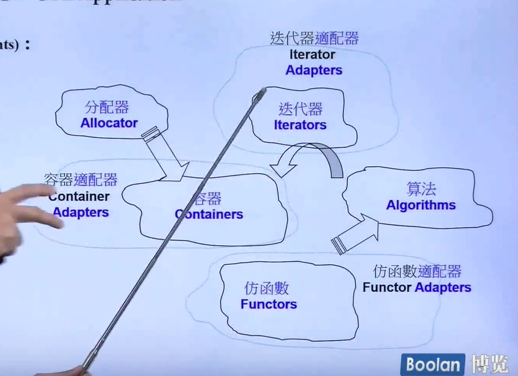
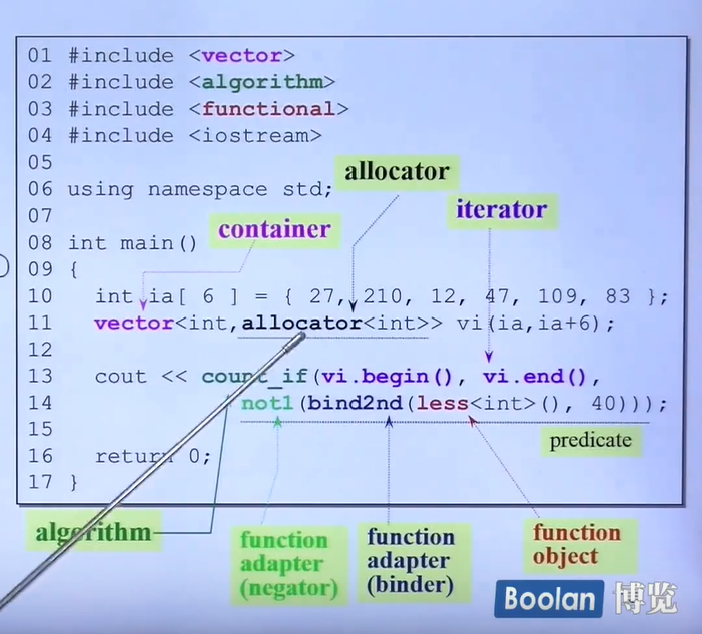

### STL六大部件
-----------------------------
* **容器**(Containers)
* **分配器**(Allocators)
* **算法**(Algorithms)
* **迭代器**(Iterators)
* **适配器**(Adapters)
* **仿函数**(Functors)

其关系如下图：



见代码：



其中 vector 分配器不写则为默认。

### “前闭后开”区间
`c.begin()` 指向容器第一个元素，而 `c.end()` 指向容器的最后一个元素的后面。
> 注：*(c.end())解引用得到未知

得到迭代器的方法如下：
```cpp
Container<T> c;
...
Container<T>::iterator ite = c.begin();
for(; ite != c.end(); ++ite)
...
```

### range-based for statement(since c++11)
一种对容器的新型循环方法：
```
for (decl : coll){
    statement
}
```
```cpp
std::vector<double> vec;
...
for(auto elem : vec){        
    std::cout << elem << std::endl;
}
for(auto elem : vec){
    elem *= 3;
}
```