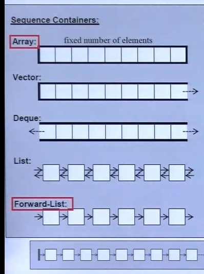
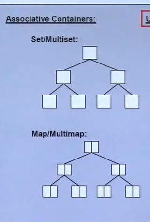
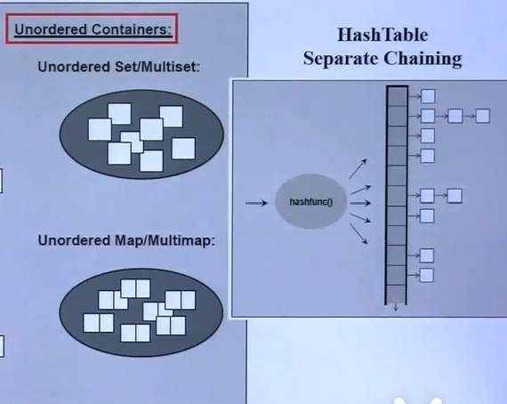

* **序列式容器(Sequence Containers)**
* **关联式容器(Associative Containers)** 有key，可以进行快速查找
* **无序容器(Unordered Containers)** c++11新增，其实也是关联容器的一种

### 序列容器

- **Array** 
多大就多大，无法扩充。

- **Vector** 
放进元素，由分配器分配内存自动增长。vector的容量是两倍增长的，容量为4的时候，添加第5个元素的时候容量变为8。

- **Deque** 
双向队列，两端均可进可出。

- **List** 
双向环状链表，通过指针串联。

- **Forward-List** 
单向链表。

### 关联式容器

- **Set/Multiset** 
红黑树（高度平衡二叉树）做的，每一个节点 key 就是 value ，Multi- 可以有重复的内容。

- **Map/Multimap** 
红黑树（高度平衡二叉树）做的，每一个节点由 key 和 value 组成。

### 无序容器
就是 HashTable ，有很多篮子，一个篮子就是一个链表   

- **Unordered Set/Multiset** 
- **Unordered Map/Multimap** 

### 测试