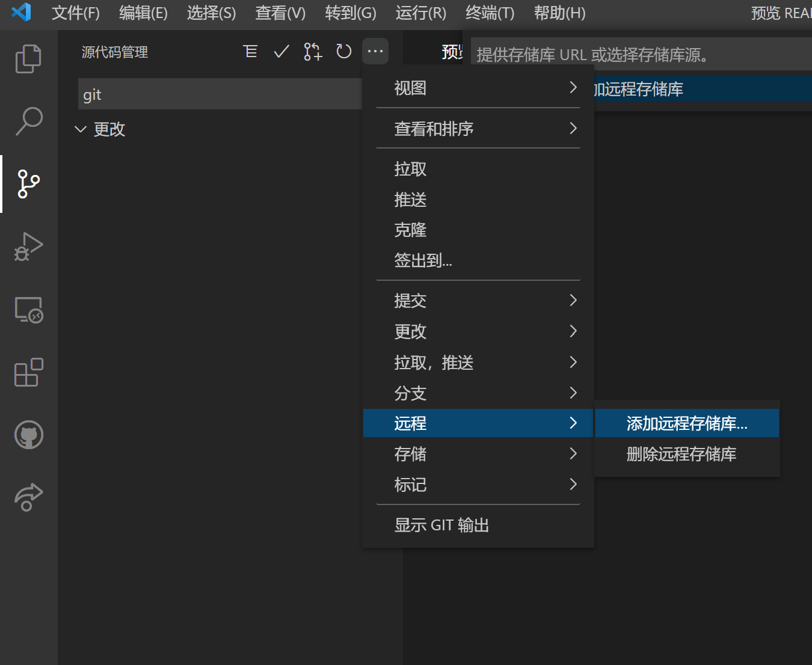
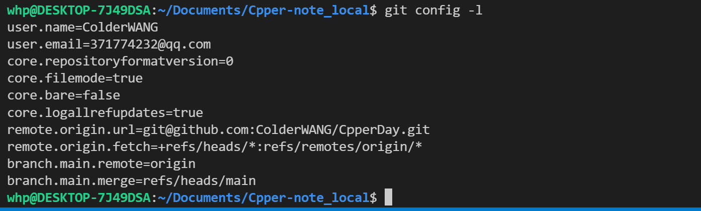
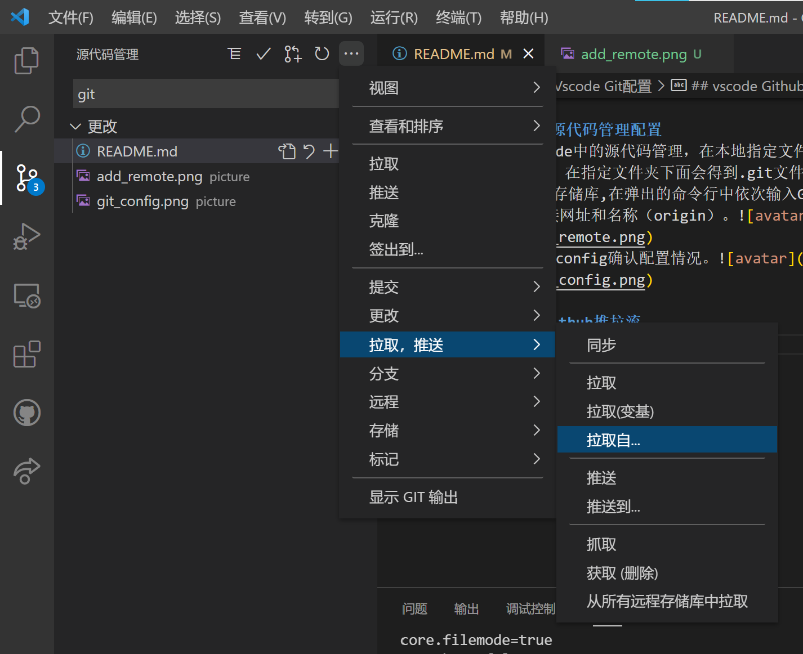

# Vscode Git配置
- [Vscode Git配置](#vscode-git配置)
  - [vscode git配置](#vscode-git配置-1)
    - [ssh配置](#ssh配置)
    - [vscode 源代码管理配置](#vscode-源代码管理配置)
  - [vscode Github推拉流](#vscode-github推拉流)

------------------------------
## vscode git配置

### ssh配置
>首先进行 git 用户设置。
>```
>git config  --global user.name ColderWANG
>git config  --global user.email 371774232@qq.com
>```
>SSH 协议是 HTTPS 以外，访问 GitHub 的另一协议。SSH 协议使用公钥、私钥认证，而不是使用密码认证。也就是说，使用 SSH 协议可以省去每次输密码的过程。
可以分为两步：
>1. 本地生成密钥对。
>2. 设置 github 的公钥。

>输入 `ssh-keygen` 生成密钥对，过程回车默认即可。生成的位置在 `~/.ssh` ，公钥为 `id_rsa.pub` ,私钥为 `id_rsa`。     
>接下来就是将公钥存到 GitHub：
>1. 登陆你的 github 帐户。然后 `Account Settings` -> 左栏点击 `SSH Keys` -> 点击 `Add SSH key`。
>2. 然后你复制上面的公钥内容，粘贴进“Key”文本域内。 title 域随意。点击 `Add key`。
>3. 使用 `ssh -T git@github.com` 测试一下连接

### vscode 源代码管理配置
>1. 点击vscode中的源代码管理，在本地指定文件夹下初始化本地仓库，在指定文件夹下面会得到.git文件夹
>2. 添加远程存储库,在弹出的命令行中依次输入Github中项目的ssh连接网址和名称（origin）。
>3. 通过git config确认配置情况。

## vscode Github推拉流
> * 拉流：在如下弹出的命令行中可以选择 `origin` 及分支。
> * 推流：